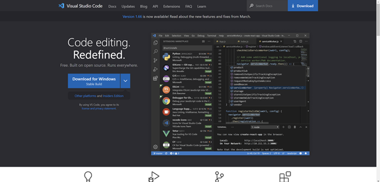
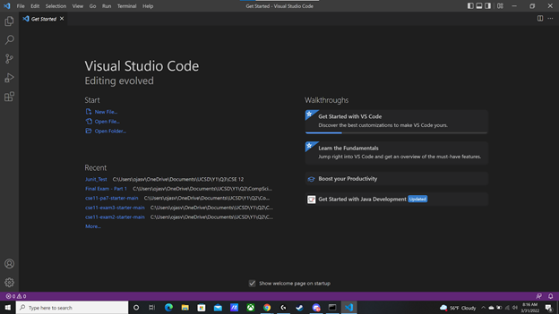
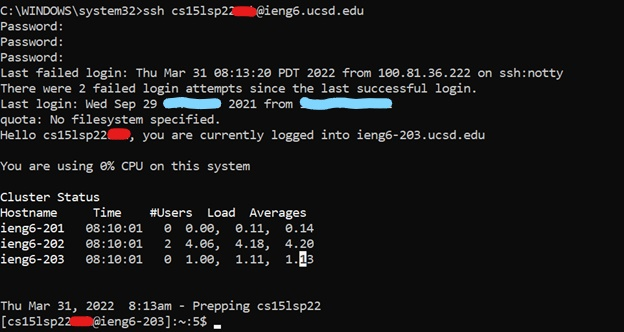
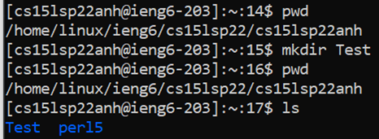
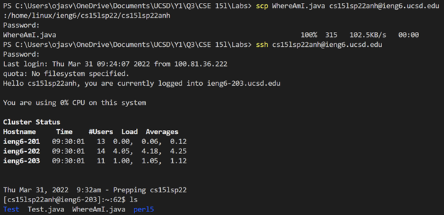
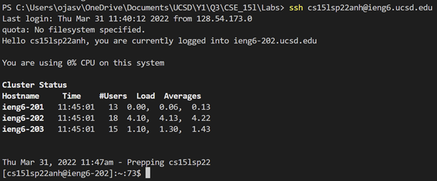
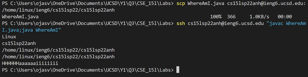

# LAB Report 1 - Week 2
### Ojasvi Tewari
### A16903749
### Group 7

[Home](index.html) | Lab Report: | [1](lab-report-1-week-2.html) | [2](lab-report-2-week-4.html) | [3](lab-report-3-week-6.html) | [4](404.html) | [5](404.html)

### Part 1 - Instating VScode
1. Go to https://code.visualstudio.com/ and click the download link for appropriate operating system (Windows in my case).

    
2. Run the exe file you downloaded and click on accept option 
3. Click Next until it shows install (you can change things to your prefference here but for simplicity just hit next).
4. Click on install and then finish.
5. Type `visual studio code` in the search bar and click to run.

    

### Part 2 - Remotely Connecting
1. Open a new terminal in VS code or just Open command prompt (either works).
2. Input `ssh cs15lsp22<your_username>@ieng6.ucsd.edu`
3. Step 4 is only neccessary if you haven't set up the ssh public and private keys.
4. Input your password. (Note: you will not be able to see typing but it is working)
5. Input `exit` whenever you want to loggout/disconnect from server.

    

### Part 3 - Trying Some Commands
1. Remotly Connect to server. 
2. Input `pwd` (will show current directrory)
3. Input `mkdir Test` (will make a folder called Test)
4. Input `ls` (will show all files and folders in current directory)

    

## Part 4 - Moving Files with `scp`
1. Open local command prompt or VScode terminal.
2. Type in the following:

    `scp <file_name>.<file_extention> cs15lsp22<your_username>@ieng6.ucsd.edu:<full_path_of_directory_where_you_want_to_store_the_file>`
3. Input password if you haven't set up ssh key.

    

### Part 5 - Setting an SSH Key
1. In local terminal (VScode or command prompt) input `ssh-keygen`
2. Then press enter for default directory for key storage.
3. Press enter again and make sure to not type anything else since we **DON'T** want a password.
4. Press enter again and then remember the directory or don't clear the terminal.
5. For windows there are extra steps that I followed (link from Lab 1 Writup) [go here](https://docs.microsoft.com/en-us/windows-server/administration/openssh/openssh_keymanagement#user-key-generation) if you wish to do so too.
6. Log onto ieng6 server.
7. Input `mkdir .ssh`then Input `exit`.
8. Back in the local system Input the following:

    `scp <full path of the id_rsa.pub file> cs15lsp22<your_username>@ieng6.ucsd.edu:~/.ssh/authorised_keys`

    *Full path from when I told you to remember the directory

    

9. Now you can login or transfer files without having to input your paswords every time.

### Part 6 - Optimizing Remote Running
1. You can quickly run commands on a server (in one command) by writing it in quotes after an ssh command.

    `ssh cs15lsp22<your_username>@ieng6.ucsd.edu "pwd"`
2. By adding a semicolon you can run multiple commands.

    `ssh cs15lsp22<your_username>@ieng6.ucsd.edu "javac Test.java; java Test"`
3. Use the up arrow to go and access previously used commands. (Helps when testing code on server or just in general too)

    
