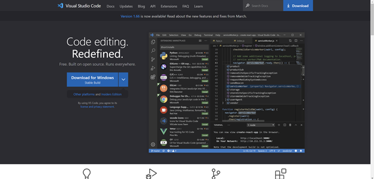

# LAB Report 1 - Week 2
### Ojasvi Tewari
### A16903749
### Group 7

[Home](index.html) | Lab Report: [1](lab-report-1-week-2.html) | 2 | 3 | 4 | 5

### Part 1 - Instating VS code
1. Go to https://code.visualstudio.com/ and click the download link for appropriate operating system (Windows in my case).

2. Run the exe file you downloaded and click on accept option 
3. Click Next until it shows install (you can change things to your prefference here but for simplicity just hit next).
4. Click on install and then finish.
5. Type `visual studio code` in the search bar and click to run.
![VS_running]

### Part 2 - Remotely Connecting
