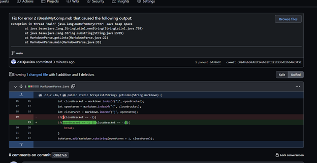
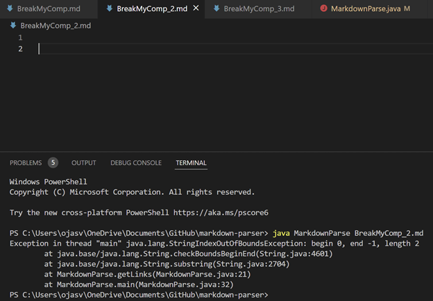
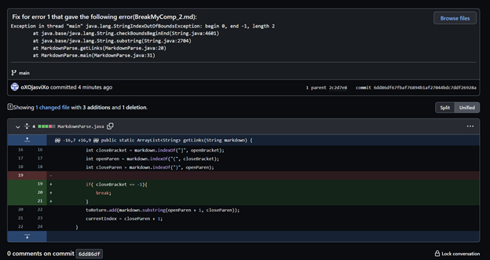
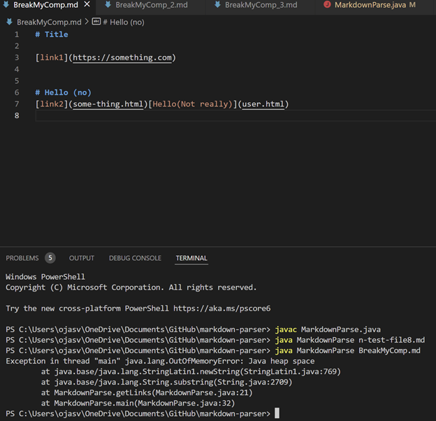
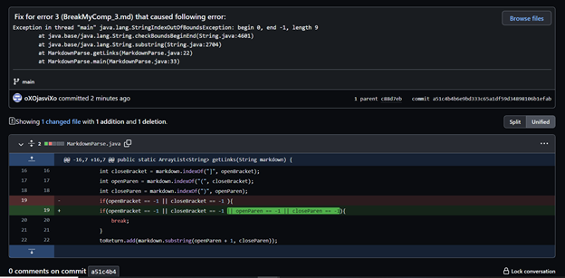
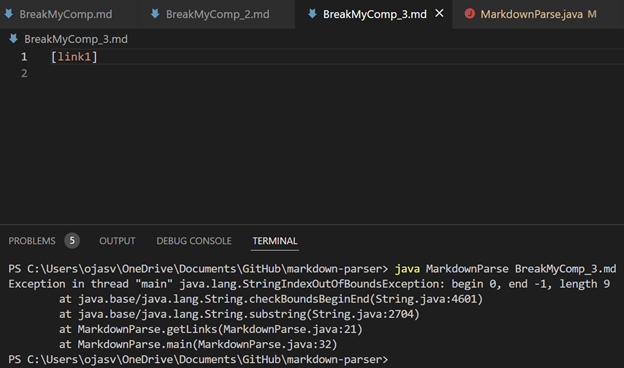

# LAB Report 2 - Week 4
### Ojasvi Tewari
### A16903749
### Group 7

[Home](index.html) | Lab Report: | [1](lab-report-1-week-2.html) | [2](lab-report-2-week-4.html) | [3](lab-report-3-week-6.html) | [4](404.html) | [5](404.html)

## Fixes, Bugs and Symptoms
1. Error 1:

    

    [Link to BreakMyComp_2](https://github.com/oXOjasviXo/markdown-parser/blob/main/BreakMyComp_2.md)

    It's Symptoms:

    

    The above Bug occurs due to the -1 index value being returned by all of the `markdown.indexOf(<String>,<index>)` calls when it doesn't find the specified string. The `indexOf()` function will always return -1 for any character in this file because it is empty.Thats why by identifiying any of the `"(",")","[","]"` string index values as -1 and breaking the loop will fix this.
2. Error 2:

    

    [Link to BreakMyComp](https://github.com/oXOjasviXo/markdown-parser/blob/main/BreakMyComp.md) 

    It's Symptoms:

    

    The above error occurs due to the -1 index value being returned by `markdown.indexOf(")",openParen)` and then causing an infinite loop eating up all the memory. This happens because `currentIndex` is updated back to `0` when `closeParen` is `-1` because of the line `currentIndex = closeParen + 1;` this basically restarts the process of identifying all the links on the page until it reaches the blank line again and restarts again leading to the `OutOfMemoryError`. So identifying whenever `closeParen` is equal to `-1` and breaking the loop at that point will prevent this.
3. Error 3:

    

    [Link to BreakMyComp_3](https://github.com/oXOjasviXo/markdown-parser/blob/main/BreakMyComp_3.md)

    It's Symptoms:

    

    The above error occurs because of the return value of -1 of `markdown.indexOf("(",closeBracket)` causing an idex out of bounds exception when trying to store the value in the `toReturn` ArrayList. This happens because -1 is out of the range for the index of a string (or anything else), but because the program still tries to access the substring of `markdown` using the -1 value java throws the StringIndexOutOfBoundsException. By identifying when any of the `indexOf()` for `"(",")","[","]"` are -1 we break the loop.
