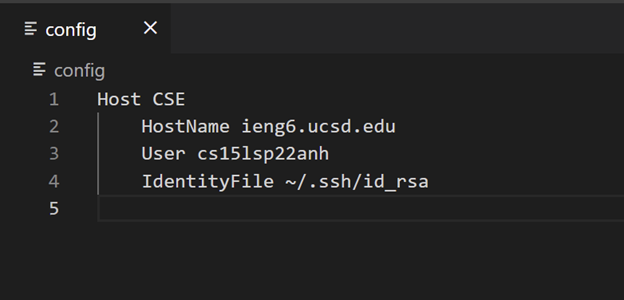
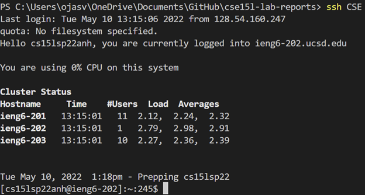
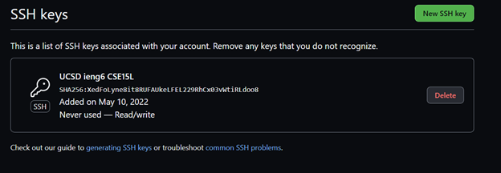
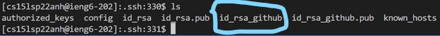
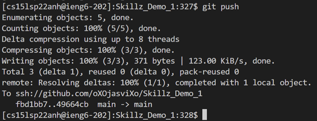
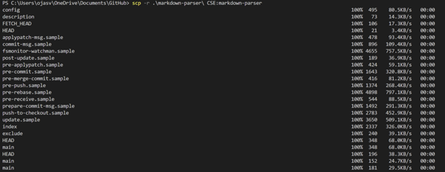
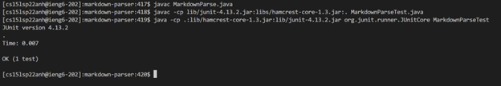
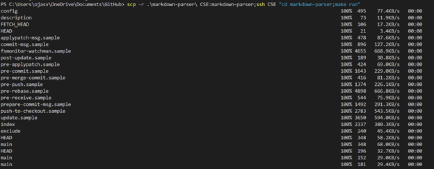
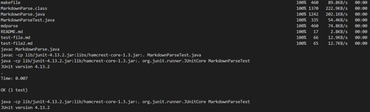

# LAB Report 3 - Week 6
### Ojasvi Tewari
### A16903749
### Group 7

[Home](index.html) | Lab Report: | [1](lab-report-1-week-2.html) | [2](lab-report-2-week-4.html) | [3](lab-report-3-week-6.html) | [4](lab-report-4-week-8.html) | [5](lab-report-5-week-10.html)

## SSH streamlining:

The config file allows me to define/ tell the `ssh` command what to do when a certain name(Host) is passed as an argument.

This is because the file stores the data about the domain (ieng6), username(my ieng6 username) and public key to use when a certain Host name is called.

`scp` also uses the same config file hence when an scp command is run with a valid Host(one stored in config) it will automatically use the data stored and copy the file without typing out username, domain or loging in.

Config:

Terminal Login:

Copy using `scp` :

## Github Access from ieng6:

Git hub access was simple, following the same process as on my personal laptop I created a pair of keys and copied over the public key into the github ssh key settings area. This made it possible to have access to git commands in the command line on the ieng6 server.

Public key storted on Github:

Private key in ieng6 (circled in blue):

Pushing changes in ieng6:

Link to commit: [ieng6 Commit](https://github.com/oXOjasviXo/Skillz_Demo_1/commit/49664cbfa541f9b874cf9af51369291000c89ea5)

## Copying whole directories with `scp -r`:

This process was very straightforward, individually the `scp -r` command was the same as a normal `scp` command with the only difference being that instead of specifying a file I had to specify a folder/directory. Then logging in and running the test was also how I would have done it normally using the `javac` command to compile the 2 files and the `java` command to run the test.

Doing it in one line was also easy since in the makeFile I could define run which had dependencies on MarkdownParse.class and MarkdownParseTest.class (both of which were also previously defined in the make file) so separating the `scp -r` command and `ssh` run command with a `;`(Windows I think) in between them allowed me to essentially run the above 2 commands in one line. 

Copying markdown-parse:

Running tests on ieng6:

Copying to ieng6 and running:

