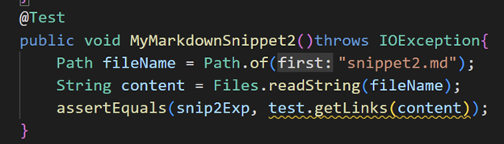
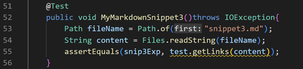

# LAB Report 4 - Week 8
### Ojasvi Tewari
### A16903749
### Group 7

[Home](index.html) | Lab Report: | [1](lab-report-1-week-2.html) | [2](lab-report-2-week-4.html) | [3](lab-report-3-week-6.html) | [4](lab-report-4-week-8.html) | [5](lab-report-5-week-10.html)

### Repositories:

- [My MarkdownParse](https://github.com/oXOjasviXo/markdown-parser/tree/d14e39f3c2269b5e1b6bb865c80733d671453e7f)
- [Week 7 MarkdownParse](https://github.com/thanhnhanlam/markdown-parser/tree/ca836f3fc8e034b8ebed4b35d0fd99ecc42f2f6e)

## Testing:

Static:

I copied(from my clone) the Week 7 MarkdownParser.java file and renamed the class (and file) to MarkdownParseWeek7 to enable myself to run tests from 1 file/directory. The github link is to the specific commit from which I cloned.

Before:

## Snippet 1:

**Expected:** \[\`google.com, google.com, ucsd.edu\]

### My Tests:

Failed

### Week 7 Tests:

Failed

## Snippet 2:

**Expected:** \[a.com, a.com\(\(\)\), example.com\]

### My Tests:

Failed

### Week 7 Tests:

Failed

## Snippet 3:

**Expected** \[https://sites.google.com/eng.ucsd.edu/cse-15l-spring-2022/schedule\]

### My Tests:

Failed

### Week 7 Tests:

Failed

## Fixes:

### Snippet 1:
I think that a less that 10 line code fix is possible if we just ignore all `[` or `]` that exist in between 2 backticks.
We can do so by adding lines to first get the indexes of the backticks (same process as getting index for brackets) then we add an if statement that if any of the bracket/paenthesis indexes are in between 2 backticks we set current index to closing parenthesis and then continue the loop (essentially ignore this set of brackets and parenthesis).

### Snippet 2:
I think this code will take more than 10 lines because there are multiple problems:
1. We will have to identify all escaped characters( one of`[ ] ( )`) and to do so we will need the indexes of all backslashes and then compare them with the index of the characters in the loop to identify whether or not to ignore the character.
2. Nested Brackets will ahve to be assigned priority which will take more than 10 lines to code on top of the above problem

### Snippet 3:
I think that this fix is possible in 10 lines. To remove the newline character from output, just remove all `\n` from the string before adding it to toReturn. To ignore initial brackets with newline in them just check if there is a newline character in between the initial brackets and if so ignore this set of brackets.