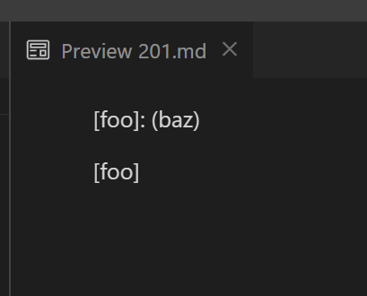
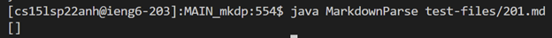
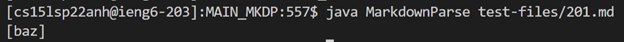
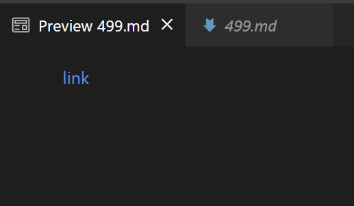
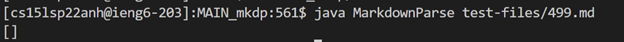
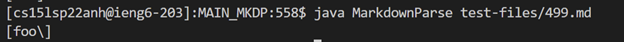

# LAB Report 5 - Week 10
### Ojasvi Tewari
### A16903749
### Group 7

[Home](index.html) | Lab Report: | [1](lab-report-1-week-2.html) | [2](lab-report-2-week-4.html) | [3](lab-report-3-week-6.html) | [4](lab-report-4-week-8.html) | [5](lab-report-5-week-10.html)

<meta http-equiv="Refresh" content="0; url='lab-report-5-week-10.html'" />

## Finding differing tests:

To find the test with different results I first ran 

`bash script.sh > results.txt`

in both the respective directories for the implementations.

After this I `cd ..` into the parent directory of both project directories and ran

`vimdiff MAIN_mkdp/results.txt MAIN_MKDP/results.txt`

`MAIN_mkdp` is the dirrectory of my implementation and `MAIN_MKDP` is the directory of the week 9 implementation

Both implementations reside in the same parent directory

`vimdiff` showed me where the results were different and then I choose 2 tests with different results in each file which seemed to be caused by different bugs

### Files I chose:

1. [201.md](https://github.com/nidhidhamnani/markdown-parser/blob/main/test-files/201.md)
2. [499.md](https://github.com/nidhidhamnani/markdown-parser/blob/main/test-files/499.md)


## Test Case \#1 (File 201.md):

### File: [201.md](https://github.com/nidhidhamnani/markdown-parser/blob/main/test-files/201.md)

### Expected: `[]`

### VScode preview:



### My Results: `[]`



### Week 9 Results: `[baz]`



### Fix:

The week 9 implementation didn't give tthe expected output.

This happened because the code in the week 9 implementation doens't look at the position of the parenthesis and bracks reletive to each other. So even if there is a space and/or other characters in between `]` and `(` the code still think the link to be valid and adds them to `toReturn`.

To fix this I would put the following code on line 69:
```
if(!(nextCloseBracket == (openParen-1))){
    continue;
}
```

this should prevent any links that don't have `]` and `(` next to each other to not be added to `toReturn`.

## Test Case \#2 (File 499.md):

### File: [499.md](https://github.com/nidhidhamnani/markdown-parser/blob/main/test-files/499.md)

### Expected: `[foo):]`

### VScode preview:



### My Results: `[]`



### Week 9 Results: `[foo\]`



### Fix:

