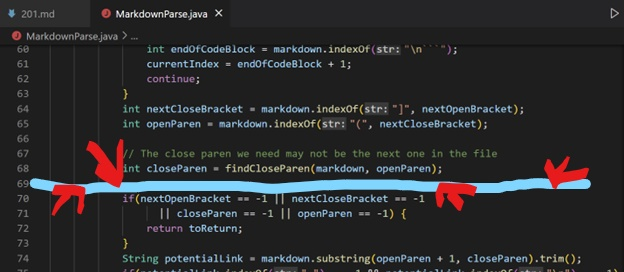
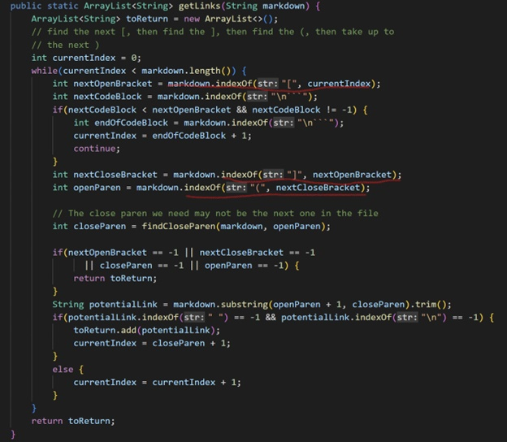

# LAB Report 5 - Week 10
### Ojasvi Tewari
### A16903749
### Group 7

[Home](index.html) | Lab Report: | [1](lab-report-1-week-2.html) | [2](lab-report-2-week-4.html) | [3](lab-report-3-week-6.html) | [4](lab-report-4-week-8.html) | [5](lab-report-5-week-10.html)

## Finding differing tests:

To find the test with different results I first ran 

`bash script.sh > results.txt`

in both the respective directories for the implementations.

After this I `cd ..` into the parent directory of both project directories and ran

`vimdiff MAIN_mkdp/results.txt MAIN_MKDP/results.txt`

`MAIN_mkdp` is the dirrectory of my implementation and `MAIN_MKDP` is the directory of the week 9 implementation

Both implementations reside in the same parent directory

`vimdiff` showed me where the results were different and then I choose 2 tests with different results in each file which seemed to be caused by different bugs

### Files I chose:

1. [201.md](https://github.com/nidhidhamnani/markdown-parser/blob/main/test-files/201.md)
2. [499.md](https://github.com/nidhidhamnani/markdown-parser/blob/main/test-files/499.md)


## Test Case \#1 (File 201.md):

### File: [201.md](https://github.com/nidhidhamnani/markdown-parser/blob/main/test-files/201.md)

### Expected: `[]`

### VScode preview:


### My Results: `[]`


### Week 9 Results: `[baz]`


### Fix:

The week 9 implementation didn't give tthe expected output.

This happened because the code in the week 9 implementation doens't look at the position of the parenthesis and bracks reletive to each other. So even if there is a space and/or other characters in between `]` and `(` the code still think the link to be valid and adds them to `toReturn`.

To fix this I would put the following code on line 69:
```
if(!(nextCloseBracket == (openParen-1))){
    continue;
}
```



this should prevent any links that don't have `]` and `(` next to each other to not be added to `toReturn`.

## Test Case \#2 (File 499.md):

### File: [499.md](https://github.com/nidhidhamnani/markdown-parser/blob/main/test-files/499.md)

### Expected: `[foo):]`

### VScode preview:


### My Results: `[]`


### Week 9 Results: `[foo\]`


### Fix:

Both implementations didn't give the expected output. I'll focus on the week 9 implementation.

This happened because the week 9 implementation doesn't escape the special characters like `[`,`]`,`(`,`)` when there is a `\` before them. Because it doesn't ignore them it uses the `)` even though it has a `\` before it and hence ends the link before it was intened to.

The fix for this will be long since whenever the code finds one of `[`,`]`,`(` or `)` it will have to check for a `\` before the character. I would do this by making/modifing the method to get the indexes of `[`,`]`,`(` or `)`. I would put the whole thing in a loop that runs at least once finds the character we are looking for then if index is equal to -1 or if character at index-1 is `\` then repeat.

```
static int findCharNoBackslash(String markdown, Character char,int start){
    int index;
    do{
        index = markdown.indexOf(char,start);
        if(markdown.charAt(index-1) != '\'){
            break;
        }
    }while(index != -1)
    return index;
}
```

I would use the above method to get the index values of whichever special character I am looking for. To fix the code I would replace all calls of `markdown.indexOf(char,start)` to `findCharNoBackslash(markdown,char,start)`. (marked red in image)



For the `findCloseParen` method I would put lines 18 and 20 in an if statement 
```
if(markdown.charAt(closeParen-1)!='\'){
    //code at line 18 or 20
}
```
